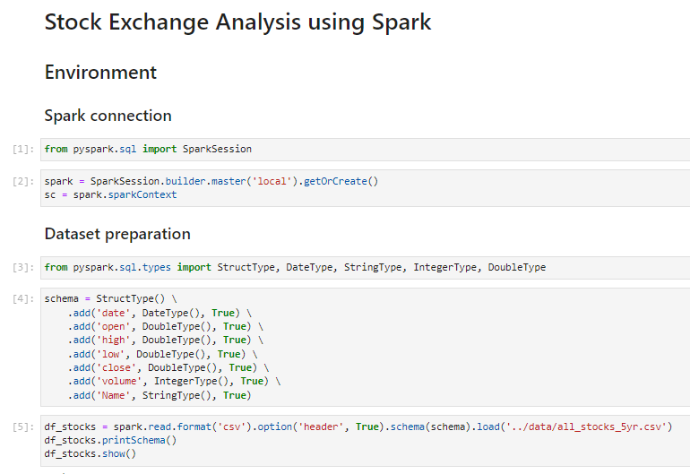

# PySpark Stock Exchange Data Analysis

📈 Stock Exchange data analysis using PySpark.



## Context

This project is my "hello world" with PySpark, originated from a [practice activity](./docs/problem_statement.pdf) of [IGTI's Data Science Bootcamp](https://www.igti.com.br/bootcamp/cientista-de-dados). It consists in application of PySpark to perform a simple data analysis using a Stock Exchange dataset, which was extracted from [this Kaggle repository](https://www.kaggle.com/camnugent/sandp500/?select=all_stocks_5yr.csv).

## Reproducing analysis

### Running on Colab

The easiest way to reproduce this analysis is by using [Google Colab](https://colab.research.google.com/). You will just need to import [quiz_colab.ipynb](./notebooks/quiz_colab.ipynb) and [all_stocks_5yr.csv](./data/all_stocks_5yr.csv) files in a new Colab's session and run it.

### Running locally

I choose to create a environment with Jupyter and Spark in my local machine using a [Docker Compose file](./docker-compose.yml), which uses [Jupyter PySpark Notebook image](https://hub.docker.com/r/jupyter/pyspark-notebook). Details of Docker Compose installation can be found on it's [official documentation](https://docs.docker.com/compose/install/).

Since you have it installed in your machine, all you need is run the following commands in a terminal window:

1. Clone repository:

```
$ git clone https://github.com/lucasfusinato/pyspark-stock-exchange-analysis
```

2. Open project's folder:

```
$ cd pyspark-stock-exchange-analysis
```

3. Start containers:

```
$ docker-compose up -d
```

And that's all! Now, you should be able to access notebook (and also running it by yourself) by clicking on [this link](http://localhost:8888/?token=a251d8fd-8df8-4f12-9b8c-874839f6a992).

## Built with

- [Docker Compose](https://docs.docker.com/compose/): Docker container's run specification tool;
- [Jupyter](https://jupyter.org/): notebook execution environment;
- [Spark](https://spark.apache.org/): engine for large-scale data analytics;
- [PySpark](https://spark.apache.org/docs/latest/api/python/): interface for Apache Spark in Python.